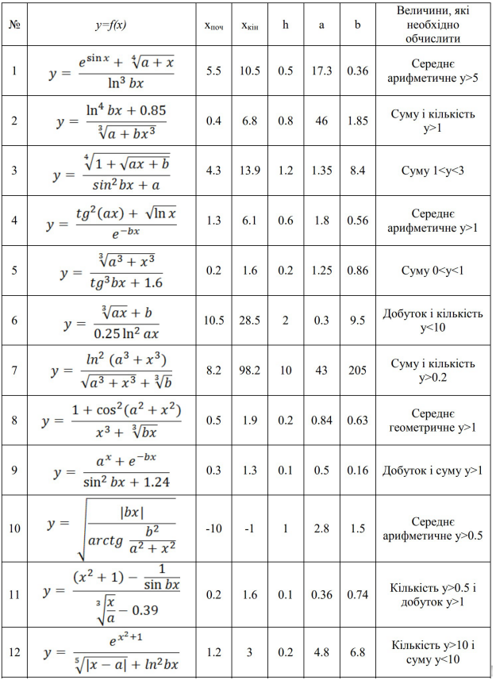
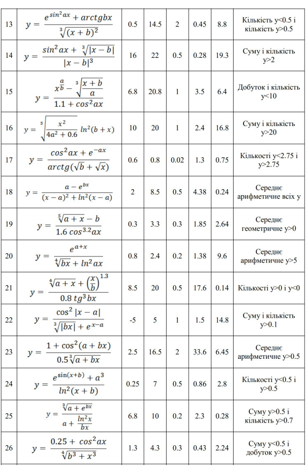
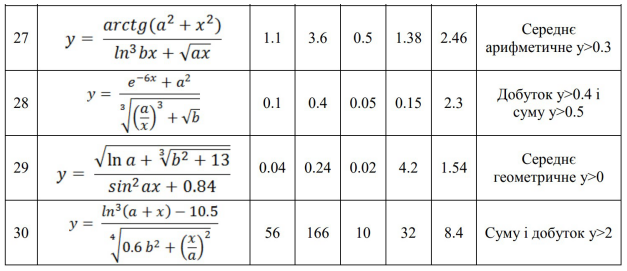

# Програмування циклічних процесів
**Мета**:   Створити,   відлагодити   та   протестувати   програму  з   циклами  для розрахунку задачі табулювання математичної функції.

## Вказівки до роботи
Відповідно до цієї інструкції вам потрібно у середовищі Visual Studio Code з використанням набору компіляторів GCC для створити програми мовою C для розрахунку математичної функції.
1. Розробити блок-схему алгоритму програми.
2. Вибрати завдання згідно свого варіанту у ДОДАТКУ.
3. Реалізувати програму розрахунку задачі табулювання математичної функції.

### Хід роботи:
Рекомендації до роботи:
1. підключіть бібліотеку math.h.
2. продумайте, які типи змінних вам потрібно використати для виконання завдання.
3. напишіть підпрограму-функцію розрахунку задачі табулювання заданої математичної функції.
4. напишіть відповідні підпрограми-функції для додаткового розрахунку необхідної величини згідно завдання (суму, добуток, кількість членів ряду, середнє арифметичне, середнє геометричне).
5. використайте циклічні оператори для досягнення мети роботи.
6. програма має вивести на консоль (термінал) вхідні дані до розрахунку та результат виконання.

### Оформлення звіту
У звіті навести
1. Свій варіант індивідуального завдання.
2. Блок-схема алгоритму програми.
3. Код (лістинг) програми.
4. Результати тестування для різних вхідних умов.
5. Конструктивний висновок — що ви дізналися нового, чого навчилися, якими способами та інструментами досягнули мети.

## ДОДАТОК

### Варіанти завдань

